  <h2><b>My Profile & Stats 🌟</b></h2>

  <picture>
    
  </picture>

 

  
  <h2><b>Tools and Skills 🛠️</b></h2>

  

    
    
    
    
  

  

    
    
    
  

  

    
    
    
    
    
  

 

  

